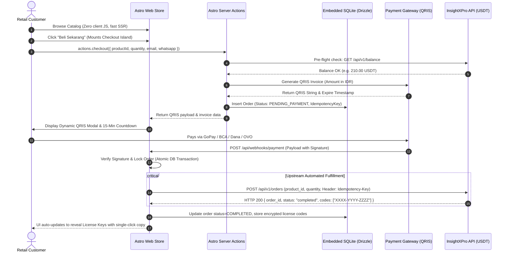

# Architecture & Technical Design - Pixel Store (Astro Edition)

## 1. System Overview & Astro Island Architecture

Pixel Store is built using **Astro (SSR / Node Adapter)**. It delivers a fast, lightweight, and low-resource e-commerce experience by serving **Zero-JS HTML** by default for catalog browsing and selectively hydrating interactive **Astro Islands** only when the customer interacts with checkout and payment flows.

```mermaid
flowchart TD
    subgraph ClientBrowser ["Client Browser"]
        StaticCatalog["HTML Catalog (0 KB JavaScript)"]
        InteractiveIslands["Interactive Islands (Checkout Drawer & QRIS Modal)"]
    end

    subgraph AstroServer ["Astro Application Server (Single Node Process)"]
        PageRenderer["SSR Page Engine (src/pages/*.astro)"]
        AstroActions["Astro Actions (src/actions/index.ts)"]
        WebhookEndpoint["API Endpoint (src/pages/api/webhooks/payment.ts)"]
        
        subgraph InternalServices ["Core Services"]
            FXService["FX & Margin Engine"]
            InsightClient["InsightXPro Wholesale Client"]
            RateLimiter["In-Memory Token Bucket"]
        end

        subgraph LocalStorage ["Embedded Data Layer"]
            SQLite[(Embedded SQLite / Drizzle ORM)]
        end
    end

    subgraph ExternalThirdParties ["External Services"]
        PG["Local Payment Gateway (QRIS)"]
        Upstream["InsightXPro API (USDT)"]
    end

    StaticCatalog -->|Rendered from Server| PageRenderer
    InteractiveIslands -->|Invoke Action: checkout()| AstroActions
    AstroActions --> FXService
    AstroActions --> PG
    AstroActions --> SQLite

    PG -->|Webhook Callback| WebhookEndpoint
    WebhookEndpoint -->|Verify & Lock Order| SQLite
    WebhookEndpoint -->|POST /api/v1/orders| InsightClient
    InsightClient --> Upstream
    InsightClient -->|Receive License Keys| WebhookEndpoint
    WebhookEndpoint -->|Update Order to COMPLETED| SQLite
```

---

## 2. End-to-End Sequence Diagram



---

## 3. Technology Stack Decisions (Enteng & Simpel)

| Layer | Selection | Justification & Performance Impact |
| :--- | :--- | :--- |
| **Core Framework** | **Astro 5+ (SSR Mode)** | Ultra-fast initial page load, zero JS payload on landing page, low memory footprint (~50-70 MB RAM). |
| **Interactive Islands** | **React / Preact Islands** | Used only for the Checkout Drawer and QRIS countdown modal. Rest of page remains pure static HTML. |
| **Language** | **TypeScript (Strict Mode)** | End-to-end type safety, standard `ActionResponse<T>`, zero `any`. |
| **Styling** | **Tailwind CSS** | Clean Minimalist styling without runtime CSS overhead. |
| **Database & ORM** | **PostgreSQL + Drizzle ORM (`postgres.js`)** | Enterprise-grade ACID compliance, connection pooling, and multi-user concurrency. Supports cloud providers (Supabase, Neon, Railway). |
| **Authentication & Accounts** | **Customer Account & Admin Sessions** | Secure scrypt-hashed credentials, 30-day customer sessions, and HMAC-SHA256 admin tokens with full order history. |
| **State / Caching** | **In-Memory Store (Native Map)** | In-memory TTL cache for catalog and in-memory token bucket for supplier rate limits (zero Redis required). |
| **Server Actions** | **Astro Actions (`astro:actions`)** | Type-safe RPC with built-in Zod validation, replacing REST boilerplate for user interactions. |
| **API Endpoints** | **Astro Endpoints (`src/pages/api/`)** | Lightweight endpoint dedicated to receiving payment gateway webhooks. |

---

## 4. Key Architectural Patterns

### 4.1 Astro Islands (Partial Hydration)
- The entire storefront (Hero, Brand, Catalog Grid, Footer) is pre-rendered on the server into pure semantic HTML with CSS.
- Only the **Checkout Sheet**, **User Account Modal**, and **QRIS Payment Dialog** are loaded as reactive islands.
- **Outcome**: The mobile browser downloads minimal JavaScript, resulting in sub-second LCP on 4G networks.

### 4.2 PostgreSQL Database & Account Architecture
- Scalable, reliable PostgreSQL cluster connection via `postgres.js` with SSL support (`sslmode=require`) and connection pooling.
- Auto-initialization on startup (`ensureDatabaseTables`) creates all required schemas (`app_settings`, `users`, `user_sessions`, `products_cache`, `orders`, `payments`) and performance indexes without downtime.
- Hybrid Checkout Model: Supports friction-free Guest Checkout while automatically associating orders to registered User Accounts (`orders.user_id`) when logged in.

### 4.3 Resilience & Upstream Safeguards
1. **Idempotency Guarantee**: `Idempotency-Key` (UUIDv4) is generated at order creation and reused for every call to InsightXPro `POST /api/v1/orders`.
2. **Rate Limit Conformance**: In-memory token bucket ensures Pixel Store never exceeds 60 req/min or 10 orders/min.
3. **Pre-flight Balance Check**: Every checkout attempt checks `GET /api/v1/balance` before issuing a QRIS code.
